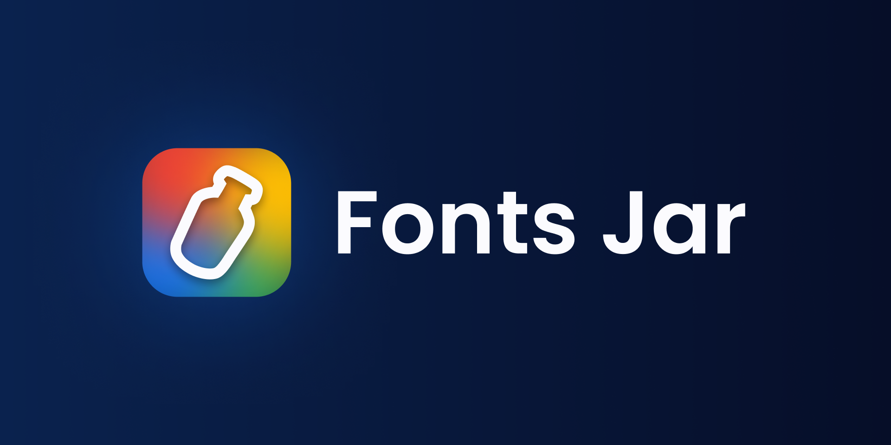

# Fonts Jar

Fonts Jar is a useful Chrome extension to save your favorite fonts when websites do not have an "add to favorites" feature by default. The goal is to support an always increasing number of websites, in order to be able to use this extension as a cross-website utility and typography management tool.

## ⬇️ How to install

Fonts Jar is currently not available for download from the chrome web store, because it is still in beta. If you want to install it, you need to follow these steps:

1. Download the latest [release](https://github.com/DaveKeehl/fonts-jar/releases)
2. Go to your Chrome extensions (type "chrome://extensions/" in Chrome)
3. Enable developer mode by clicking on the toggle in the top right corner
4. Unzip the latest release you have downloaded in step 1
5. Click on "load unpacked" and select the unzipped release you have obtained in step 4

## ✨ Supported websites

Fonts Jar currently supports the following websites:

- [Google Fonts](https://fonts.google.com/)

## 🧭 Roadmap

You can track the development progress of Fonts Jar by looking at our [roadmap](https://github.com/users/DaveKeehl/projects/6).

## 🙋🏻‍♀️ Requests

You can request new websites to be supported by creating a [new issue](https://github.com/DaveKeehl/fonts-jar/issues/new).

## 📚 Versioning

This project uses [Semantic Versioning](https://semver.org/) to keep track of its version number.

## ✍🏻 Changelog

[CHANGELOG](https://github.com/DaveKeehl/fonts-jar/blob/main/CHANGELOG.md)

## 👨🏻‍⚖️ License

[MIT](https://github.com/DaveKeehl/fonts-jar/blob/main/LICENSE)
